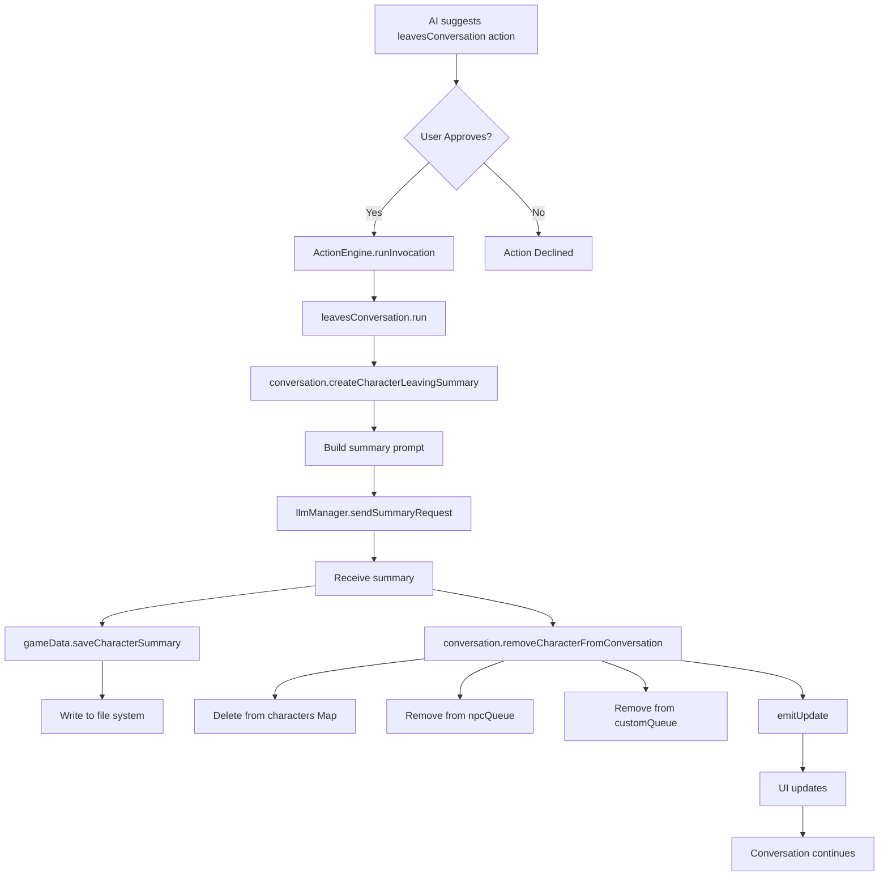

# Implementation Plan: leavesConversation Action

## Overview
Implement the `leavesConversation` action to handle characters leaving a conversation mid-session. This action will:
1. Generate and save a personal summary for the leaving character
2. Remove the character from the conversation entirely
3. Allow the conversation to continue with remaining participants

## Current State Analysis

### Existing Action Structure
- **File**: [`default_userdata/actions/standard/z_leavesConversation.js`](default_userdata/actions/standard/z_leavesConversation.js:1)
- **Status**: Template with empty `gameEffect` and basic structure
- **Properties**:
  - `signature`: "leavesConversation"
  - `isDestructive`: true (requires user approval by default)
  - [`check()`](default_userdata/actions/standard/z_leavesConversation.js:25): Returns all non-player characters as valid targets
  - [`run()`](default_userdata/actions/standard/z_leavesConversation.js:43): Currently returns placeholder message

### Related Systems

#### Summary Generation
- **Location**: [`src/main/conversation/Conversation.ts`](src/main/conversation/Conversation.ts)
- **Key Methods**:
  - [`createFinalSummary()`](src/main/conversation/Conversation.ts:764): Creates comprehensive summary at conversation end
  - [`createRollingSummary()`](src/main/conversation/Conversation.ts:138): Creates partial summaries during conversation
- **Storage**: [`GameData.saveCharacterSummary()`](src/main/gameData/GameData.ts:270) saves individual character summaries

#### Character Management
- **Location**: [`src/main/gameData/GameData.ts`](src/main/gameData/GameData.ts)
- **Data Structure**: `characters: Map<number, Character>`
- **Access**: Characters retrieved via `gameData.characters.get(id)`

#### Conversation Queue
- **Location**: [`src/main/conversation/Conversation.ts`](src/main/conversation/Conversation.ts)
- **Properties**:
  - [`npcQueue`](src/main/conversation/Conversation.ts:34): Array of characters waiting to respond
  - [`fillNpcQueue()`](src/main/conversation/Conversation.ts:501): Populates queue with shuffled NPCs
  - [`getNpcList()`](src/main/conversation/Conversation.ts:200): Gets all non-player characters

## Implementation Tasks

### 1. Add Summary Generation Method to Conversation Class
**File**: [`src/main/conversation/Conversation.ts`](src/main/conversation/Conversation.ts)

**Action**: Create new method `createCharacterLeavingSummary(characterId: number)`

**Details**:
- Similar to [`createFinalSummary()`](src/main/conversation/Conversation.ts:764) but for a single character
- Use all messages from [`getHistory()`](src/main/conversation/Conversation.ts:804) up to current point
- Include current rolling summary if it exists
- Use LLM to generate summary via [`llmManager.sendSummaryRequest()`](src/main/conversation/Conversation.ts:788)
- Return the generated summary string

**Prompt Structure**:
```javascript
const summaryPrompt = [
  {
    role: 'system',
    content: `You are summarizing a conversation from the perspective of ${character.shortName} who is leaving.`
  },
  // Include rolling summary if exists
  // Include all conversation messages
  {
    role: 'user',
    content: 'Create a comprehensive summary of this conversation from this character\'s perspective.'
  }
];
```

### 2. Add Character Removal Method to Conversation Class
**File**: [`src/main/conversation/Conversation.ts`](src/main/conversation/Conversation.ts)

**Action**: Create new method `removeCharacterFromConversation(characterId: number)`

**Details**:
- Remove character from [`gameData.characters`](src/main/gameData/GameData.ts:233) Map
- Remove character from [`npcQueue`](src/main/conversation/Conversation.ts:34) if present
- Remove character from [`customQueue`](src/main/conversation/Conversation.ts:35) if present
- Log the removal for debugging
- Call [`emitUpdate()`](src/main/conversation/Conversation.ts:821) to notify UI

**Implementation**:
```typescript
removeCharacterFromConversation(characterId: number): void {
    // Remove from characters map
    this.gameData.characters.delete(characterId);
    
    // Remove from NPC queue
    this.npcQueue = this.npcQueue.filter(char => char.id !== characterId);
    
    // Remove from custom queue if exists
    if (this.customQueue) {
        this.customQueue = this.customQueue.filter(char => char.id !== characterId);
    }
    
    console.log(`Character ${characterId} removed from conversation`);
    this.emitUpdate();
}
```

### 3. Implement the Action's run() Method
**File**: [`default_userdata/actions/standard/z_leavesConversation.js`](default_userdata/actions/standard/z_leavesConversation.js)

**Action**: Complete the [`run()`](default_userdata/actions/standard/z_leavesConversation.js:43) method implementation

**Details**:
- Access the conversation instance (passed via context or global)
- Generate summary for the leaving character
- Save summary to character's file
- Remove character from conversation
- Return appropriate feedback message

**Key Considerations**:
- The `run()` method receives `gameData`, `sourceCharacter`, `targetCharacter`, and `runGameEffect`
- Need to access the active conversation instance to call summary generation
- The action is executed from [`ActionEngine.runInvocation()`](src/main/actions/ActionEngine.ts:266)
- Conversation instance is available in the calling context

### 4. Update Action Type Definitions
**File**: [`src/main/actions/types.ts`](src/main/actions/types.ts:1)

**Action**: Add conversation parameter to [`ActionRunContext`](src/main/actions/types.ts:60) interface

**Details**:
- Import `Conversation` type from conversation module
- Add optional `conversation` property to [`ActionRunContext`](src/main/actions/types.ts:60)
- This allows actions to access conversation methods when needed
- Maintains backward compatibility (optional parameter)

**Implementation**:
```typescript
// Add import at top of file
import type { Conversation } from "../conversation/Conversation";

// Update ActionRunContext interface
export interface ActionRunContext {
  gameData: GameData;
  sourceCharacter: Character;
  targetCharacter?: Character;
  runGameEffect: (effect: string) => void;
  args: ActionArgumentValues;
  conversation?: Conversation; // Add this optional property
}
```

### 5. Provide Conversation Access to Actions
**File**: [`src/main/actions/ActionEngine.ts`](src/main/actions/ActionEngine.ts:1)

**Action**: Modify [`runInvocation()`](src/main/actions/ActionEngine.ts:266) to pass conversation instance

**Details**:
- Pass `conv` parameter to action's `run()` method
- Add to the context object passed to [`action.run()`](src/main/actions/ActionEngine.ts:304)
- Ensures backward compatibility (existing actions ignore the parameter)

**Implementation**:
```typescript
// In runInvocation method, around line 304
const result = await action.run({
    gameData: conv.gameData,
    sourceCharacter: npc,
    targetCharacter: target,
    runGameEffect,
    args,
    conversation: conv // Add this line
});
```

### 6. Complete the leavesConversation Action Implementation
**File**: [`default_userdata/actions/standard/z_leavesConversation.js`](default_userdata/actions/standard/z_leavesConversation.js)

**Action**: Implement full action logic

**Implementation**:
```javascript
run: async ({ gameData, sourceCharacter, targetCharacter, runGameEffect, conversation }) => {
    if (!targetCharacter) {
        return {
            message: "Failed: No character specified to leave",
            sentiment: 'negative'
        };
    }

    if (!conversation) {
        return {
            message: "Failed: No active conversation",
            sentiment: 'negative'
        };
    }

    try {
        // Generate summary for leaving character
        const summary = await conversation.createCharacterLeavingSummary(targetCharacter.id);
        
        if (summary) {
            // Save summary to character's file
            gameData.saveCharacterSummary(targetCharacter.id, {
                date: gameData.date,
                totalDays: gameData.totalDays,
                content: summary
            });
        }
        
        // Remove character from conversation
        conversation.removeCharacterFromConversation(targetCharacter.id);
        
        // Empty game effect (for debugging)
        runGameEffect(``);
        
        return {
            message: `${targetCharacter.shortName} has left the conversation`,
            sentiment: 'neutral'
        };
    } catch (error) {
        console.error('Failed to process character leaving:', error);
        return {
            message: `Failed to process ${targetCharacter.shortName} leaving: ${error.message}`,
            sentiment: 'negative'
        };
    }
}
```

### 7. Update Action Description and Check Logic
**File**: [`default_userdata/actions/standard/z_leavesConversation.js`](default_userdata/actions/standard/z_leavesConversation.js)

**Action**: Improve [`description()`](default_userdata/actions/standard/z_leavesConversation.js:17) and [`check()`](default_userdata/actions/standard/z_leavesConversation.js:25) methods

**Details**:
- Update description to be more specific about when to use this action
- Ensure check() only returns characters currently in the conversation
- Exclude the player character from valid targets

**Implementation**:
```javascript
description: ({ sourceCharacter }) =>
    `Execute when ${sourceCharacter.shortName} decides that another character should leave the conversation. The target character will be removed from the conversation, their summary will be saved, and they will not participate in future messages.`,

check: ({ gameData, sourceCharacter }) => {
    // Get all characters except the player
    const allIds = Array.from(gameData.characters.keys());
    const validTargets = allIds.filter((id) => id !== gameData.playerID);
    
    return {
        canExecute: validTargets.length > 0,
        validTargetCharacterIds: validTargets
    };
}
```

## Testing Considerations

### Test Scenarios
1. **Basic Leaving**: Character leaves mid-conversation
   - Verify summary is generated and saved
   - Verify character is removed from queue
   - Verify character is removed from characters map
   - Verify conversation continues with remaining characters

2. **Multiple Characters**: Multiple characters leave sequentially
   - Each gets their own summary
   - Conversation continues until only player remains
   - Summaries reflect different conversation lengths

3. **Edge Cases**:
   - Character leaves while in queue (not yet responded)
   - Character leaves after just joining
   - Last NPC leaves (only player remains)
   - Character leaves during paused conversation

4. **Summary Quality**:
   - Summary includes all messages up to leaving point
   - Summary is from character's perspective
   - Summary is saved to correct file location

### Validation Points
- Check [`VOTC_SUMMARIES_DIR`](src/main/utils/paths.ts) for saved summary files
- Verify [`gameData.characters.size`](src/main/gameData/GameData.ts:233) decreases
- Verify [`npcQueue.length`](src/main/conversation/Conversation.ts:34) updates correctly
- Check console logs for summary generation and character removal

## Architecture Diagram



## File Changes Summary

### New Methods
1. [`Conversation.createCharacterLeavingSummary(characterId)`](src/main/conversation/Conversation.ts:1) - Generate leaving summary
2. [`Conversation.removeCharacterFromConversation(characterId)`](src/main/conversation/Conversation.ts:1) - Remove character

### Modified Files
1. [`src/main/conversation/Conversation.ts`](src/main/conversation/Conversation.ts:1) - Add new methods
2. [`src/main/actions/types.ts`](src/main/actions/types.ts:1) - Update [`ActionRunContext`](src/main/actions/types.ts:60) interface
3. [`src/main/actions/ActionEngine.ts`](src/main/actions/ActionEngine.ts:1) - Pass conversation to actions in [`runInvocation()`](src/main/actions/ActionEngine.ts:266)
4. [`default_userdata/actions/standard/z_leavesConversation.js`](default_userdata/actions/standard/z_leavesConversation.js:1) - Complete implementation

### No Changes Required
- [`GameData.saveCharacterSummary()`](src/main/gameData/GameData.ts:270) - Already supports individual character summaries
- [`SummariesManager`](src/main/utils/SummariesManager.ts:1) - Already handles per-character summary files
- Action approval system - Already configured via `isDestructive: true`
- [`default_userdata/gamedata_typedefs.js`](default_userdata/gamedata_typedefs.js:1) - JSDoc types are inferred from TypeScript

## Implementation Order

1. **Phase 1: Type System Updates**
   - Update [`ActionRunContext`](src/main/actions/types.ts:60) interface to add optional `conversation` parameter
   - Add import for `Conversation` type in [`types.ts`](src/main/actions/types.ts:1)

2. **Phase 2: Action Engine Integration**
   - Modify [`ActionEngine.runInvocation()`](src/main/actions/ActionEngine.ts:266) to pass conversation instance
   - Verify backward compatibility with existing actions (they simply ignore the new parameter)

3. **Phase 3: Conversation Methods**
   - Implement [`createCharacterLeavingSummary(characterId)`](src/main/conversation/Conversation.ts:1) in Conversation class
   - Implement [`removeCharacterFromConversation(characterId)`](src/main/conversation/Conversation.ts:1) in Conversation class
   - Add proper error handling and logging

4. **Phase 4: Action Implementation**
   - Complete [`leavesConversation.run()`](default_userdata/actions/standard/z_leavesConversation.js:43) method
   - Update [`description()`](default_userdata/actions/standard/z_leavesConversation.js:17) to be more specific
   - Verify [`check()`](default_userdata/actions/standard/z_leavesConversation.js:25) logic is correct

5. **Phase 5: Testing & Validation**
   - Test basic leaving scenario with 3+ characters
   - Test multiple characters leaving sequentially
   - Test edge cases (last NPC leaves, character in queue, etc.)
   - Verify summary generation and file storage
   - Verify conversation continuation works correctly
   - Check UI updates properly reflect character removal

## Additional Considerations

### Summary Prompt Design
The summary prompt for a leaving character should:
- Focus on the character's perspective and experiences
- Include context about why they're leaving (if mentioned in conversation)
- Be concise but comprehensive
- Use the same format as final summaries for consistency

### Error Handling
Key error scenarios to handle:
1. **LLM failure during summary generation**: Log error, skip summary, still remove character
2. **File system errors**: Log error but don't block character removal
3. **Character not found**: Return error feedback, don't crash
4. **No active conversation**: Return error feedback gracefully

### Performance Considerations
- Summary generation is async and may take several seconds
- User sees action approval UI immediately
- Summary generation happens after approval
- Character removal happens after summary is saved
- UI updates via [`emitUpdate()`](src/main/conversation/Conversation.ts:821) keep user informed

### Future Enhancements
Potential improvements for future iterations:
1. Add optional `reason` argument to action (why character is leaving)
2. Include leaving reason in summary if provided
3. Add game effect to trigger in-game event (character physically leaves scene)
4. Support for character rejoining conversation later
5. Notification to remaining characters about who left

## Notes

- The action is marked as `isDestructive: true`, so it will require user approval unless auto-accept is enabled
- The `gameEffect` is intentionally empty for debugging purposes (can be populated later)
- Summary generation uses the same LLM infrastructure as final conversation summaries
- Character removal is permanent for the current conversation session
- The conversation can continue even if only the player remains (no automatic ending)
- The implementation maintains backward compatibility with all existing actions
- Type safety is preserved through TypeScript interfaces
