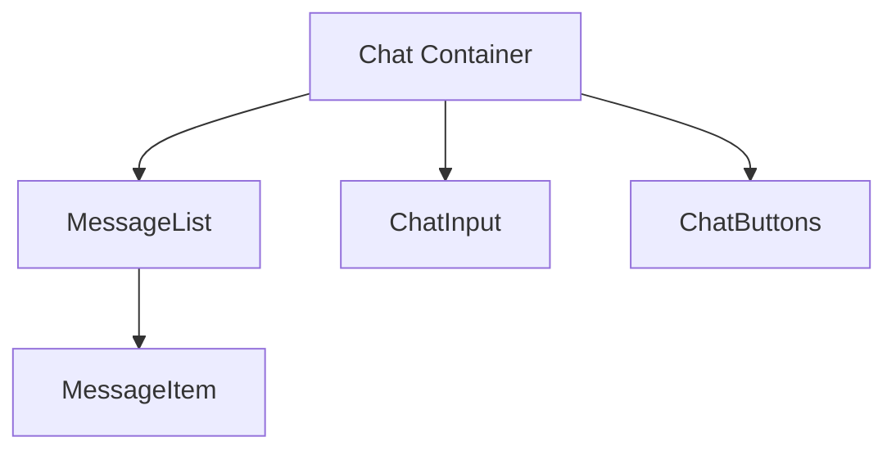

# Chat Component Refactoring Plan

## Goals
1. Improve code maintainability through decomposition
2. Enhance performance with optimized rendering
3. Separate concerns between UI and business logic
4. Create reusable components and hooks

## Proposed Component Structure

## Implementation Steps

### 1. Create Component Files
- [ ] Create `MessageItem.tsx` for individual message rendering
- [ ] Create `MessageList.tsx` for message collection
- [ ] Create `ChatInput.tsx` for message input
- [ ] Create `ChatButtons.tsx` for action buttons

### 2. Extract Custom Hooks
- [ ] Create `useChatStreaming.ts` for streaming logic
- [ ] Create `useWindowEvents.ts` for window interaction
- [ ] Create `useAutoScroll.ts` for scroll management

### 3. Refactor Chat.tsx
- [ ] Replace inline rendering with new components
- [ ] Integrate custom hooks
- [ ] Simplify state management

### 4. Testing
- [ ] Add unit tests for new components
- [ ] Verify streaming functionality
- [ ] Test window interaction behaviors

## Benefits
- **Reduced Complexity**: Main component size reduced by ~60%
- **Improved Performance**: Optimized rendering with memoization
- **Better Maintainability**: Clear separation of concerns
- **Enhanced Reusability**: Components can be used in other features

## Next Steps
1. Review and approve this plan
2. Switch to Code mode for implementation